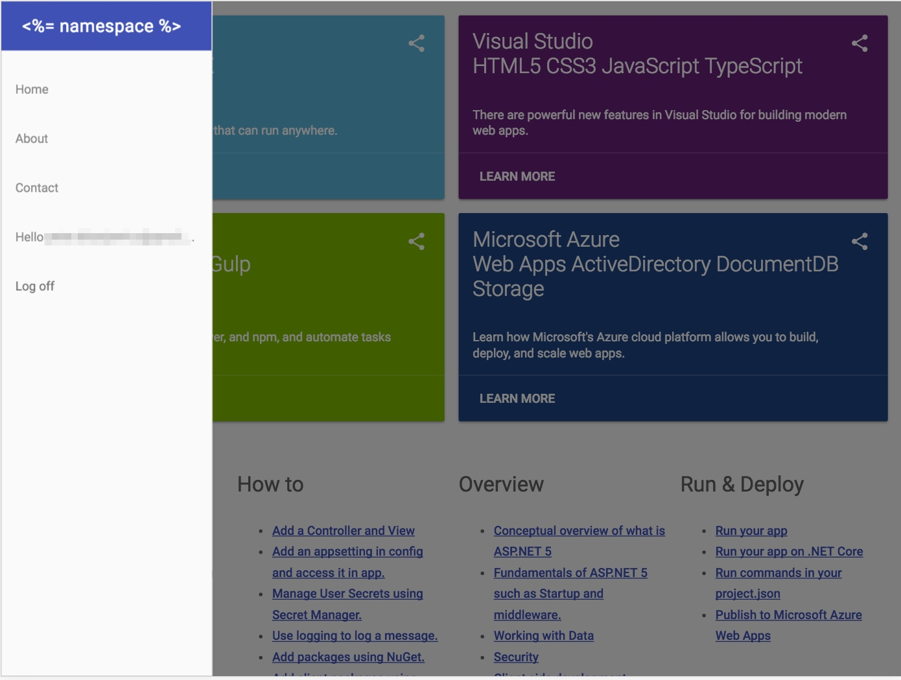
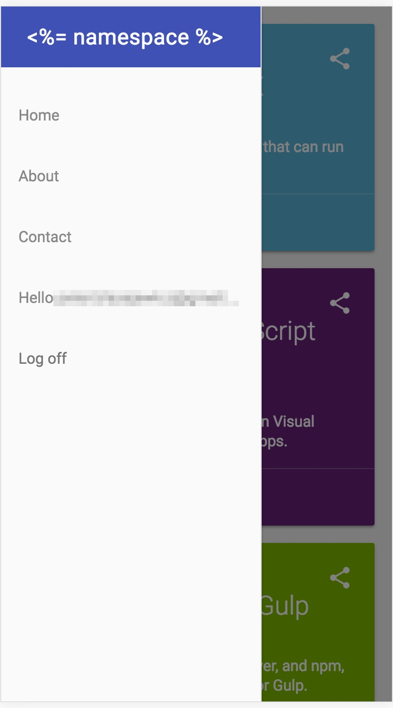
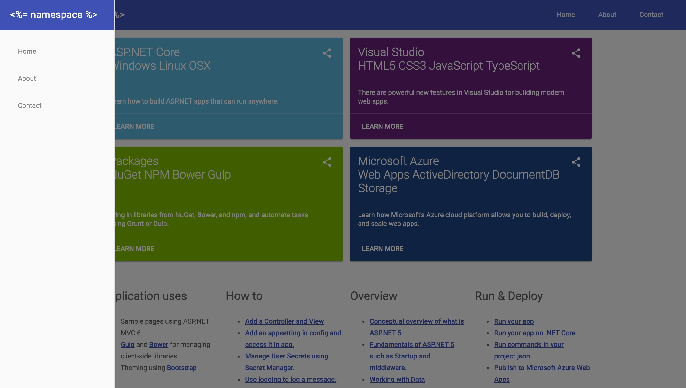
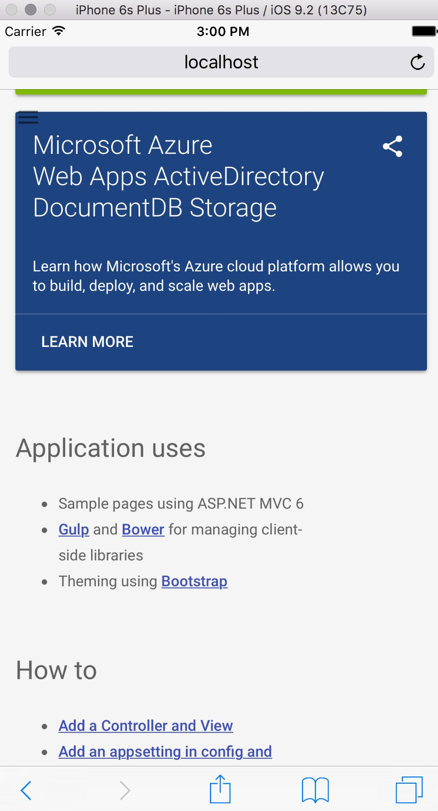

# generator-aspnet-mdl

An adaption of the Material Design Lite (MDL) to aspnet/Templates content for `yo aspnet`.

The example implements all features from ASP.NET basic web template, including:
- `ASPNET_ENV` support
- fallback support for production/staging environment
- CDN based assets with local fallback
- MDL main layout
- MDL fonts
- MDL template markup
- modern favicons from MDL
- and many more.

The example do not uses imagery from original `aspnet/Templates` project 
as there is no carousel like component in MDL. Instead custom `Card` components
are used to present ASP.NET features.

> **TODO** validation support with MDL (required for web template, `with authorization`).
At the current version `bower.json` still uses `jQuery` and `jQuery.Validate` plugins
as in original example coming from `aspnet/Templates`.

## Development

```
dnu restore
dnu build
dnx web
```
To test `Development` settings:
```
set ASPNET_ENV=Development && dnx web
```

To install client side dependencies:
```
npm install
bower install
```

## Screenshots

- iPad View



- iPhone View



- Desktop View



- Tablet View


- Mobile View



## Author

@peterblazejewicz
