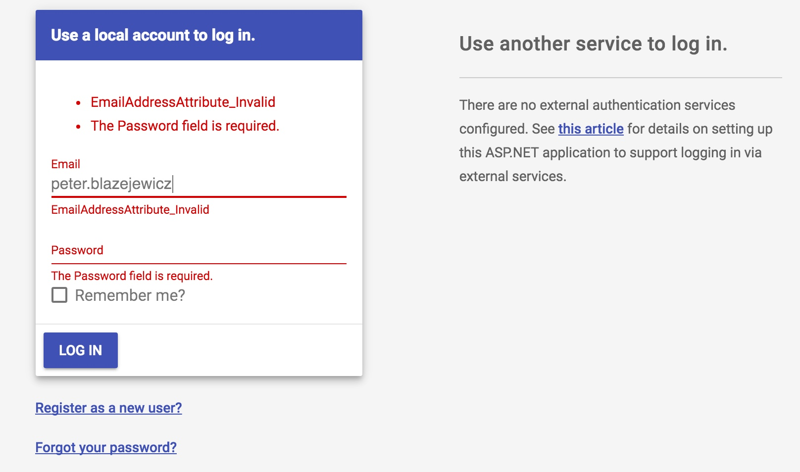
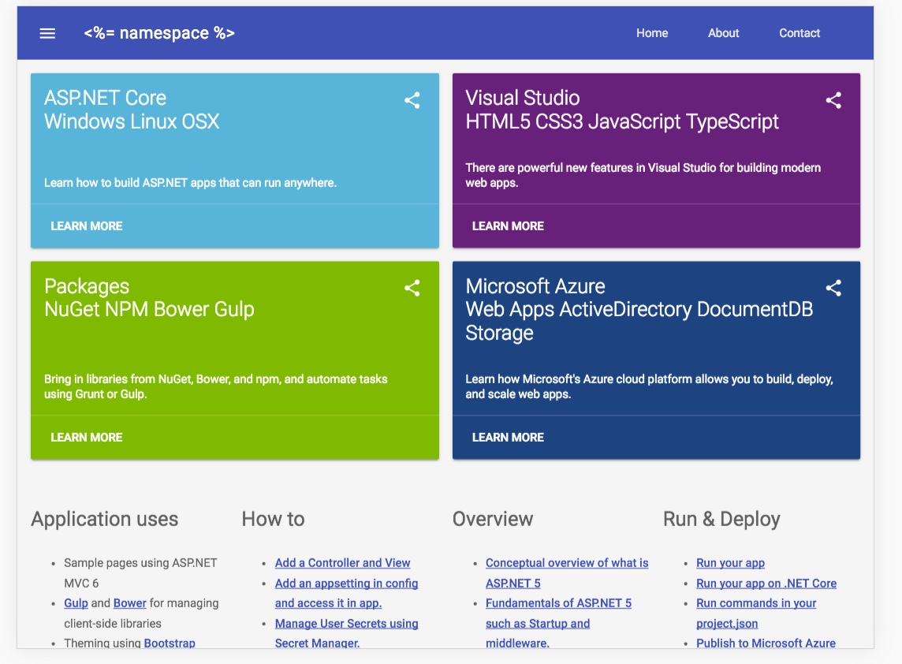

# generator-aspnet-mdl

An adaption of the Material Design Lite (MDL) to aspnet/Templates content for `yo aspnet`.

The example implements all features from ASP.NET basic web template, including:
- `ASPNET_ENV` support
- fallback support for production/staging environment
- CDN based assets with local fallback
- MDL main layout
- MDL fonts
- MDL template markup
- modern favicons from MDL
- and many more.

The example do not uses imagery from original `aspnet/Templates` project 
as there is no carousel like component in MDL. Instead custom `Card` components
are used to present ASP.NET features.

> **TODO** validation support with MDL (required for web template, `with authorization`).
At the current version `bower.json` still uses `jQuery` and `jQuery.Validate` plugins
as in original example coming from `aspnet/Templates`.

## Requirements

To run `web` template you will need to configure Twilio and Facebook as described in:
[http://docs.asp.net/en/latest/security/authentication/index.html](http://docs.asp.net/en/latest/security/authentication/index.html)

The application uses `user-secret` tool. You have to create keys for:
- Facebook:
```
user-secret set Authentication:Facebook:AppId value
user-secret set Authentication:Facebook:AppSecret value
```
- Twilio:
```
user-secret set SID value
user-secret set AuthToken value
user-secret set SendNumber value
```
- SendGrid:
```
user-secret set SendGridUser value 
user-secret set SendGridKey value
``` 

## Development

```
dnu restore
dnu build
dnx web
```
To test `Development` settings:
```
set ASPNET_ENV=Development && dnx web
```

To install client side dependencies:
```
npm install
bower install
```

## Blockers

1. Selects in MDL:
https://github.com/google/material-design-lite/issues/854
2. TODO: verify SendGrid crashing on OS X.

## Screenshots

- Validation Support [WIP]



- iPad View


- iPhone View


- Desktop View


- Tablet View



- Mobile View


## Author

@peterblazejewicz
